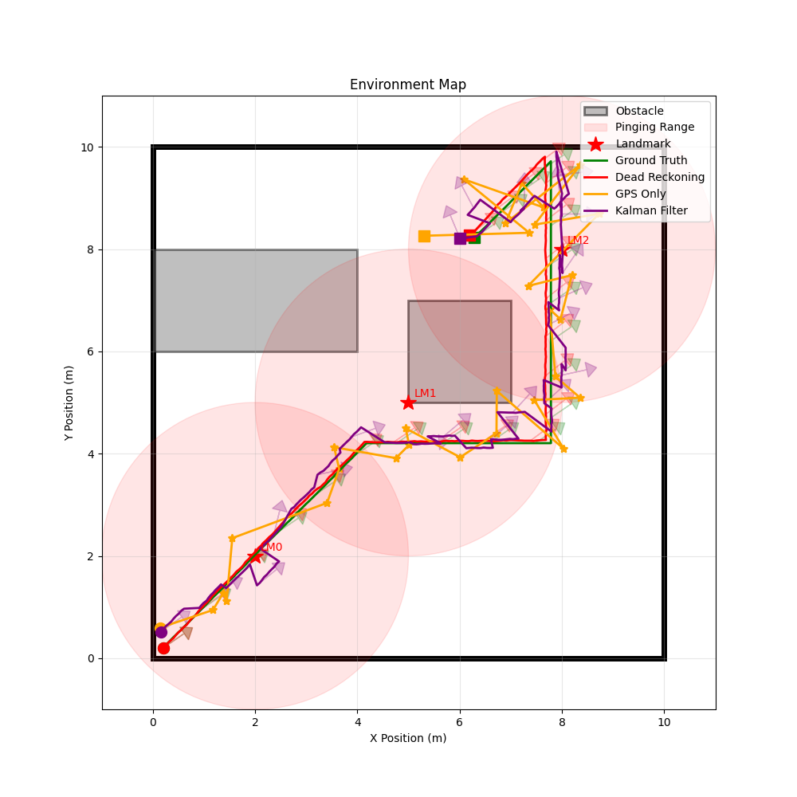
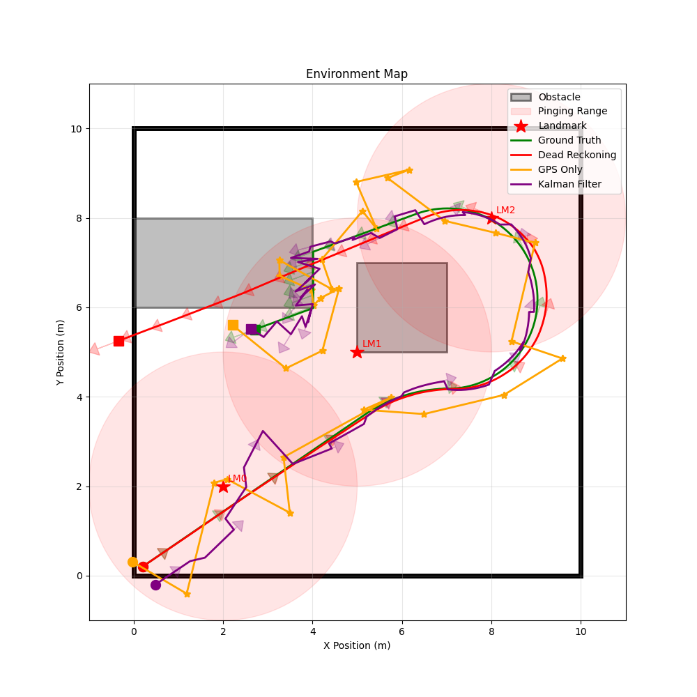

# Probabilistic Robotics Playground: Linear and Extended Kalman Filtering
> **Developed by Dexter Friis-Hecht**

## Repository Overview
This repository holds a robot sim environment with an Extended Kalman Filter and Linear Kalman Filter implementation.

## File Structure
```bash
├── src/
├── input/
├── output/
├── requirements.txt
├── README.md
```

`src` holds the source code for this project.

`input` holds input commands that control the robot.

`output` holds output files generated by the simulator. (data pickles and visualizations)

## Using the Code

### 1. Clone the Repository
```bash
git clone https://github.com/dfriishecht/probo_playground.git
cd probo_playground
```

### 2. Install Dependencies
```bash
pip install -r requirements.txt
```

### 3. Run the Code Locally
You can run the simulator in linear or non-linear model. By default, in non-linear mode and uses an Extended Kalman Filter.

To run with the Extended Kalman Filter:
```bash
python3 src/main.py
```

To run with the standard Kalman Filter:
```bash
python3 src/main.py --linear
```

The resulting trajectory plots will be saved to the `output/` directory.

## Results

### Linear Model


Overall, we see that the filter performs reasonablu well on the linear model, and is able to track the ground truth state reasonably well. However, we can also see that the filter's use of GPS data is contributing added noise to the state estimate, which makes the results differ a bit from ideal

While a mono-sensor system can work well in a simplified environment like this, it is likely not a robust solution for the real-world, especially in environemtns where GPS quality is poor or suffers from high variance.


### Non-Linear Model


In the non-linear model, we have introduced an additional challenge with the robot colliding with an obstacle. This completely throws off the quality of the Dead Reckoning, and we can see the filter overcoming that with sensor measurements. Unlike the linear model, here we incorportate linear GPS measureemnts, in addition to non-linear landmark bearing and range estimates. We can see that while the fitler had some solid variance in its estimate at the start of the sim, this is quickly corrected once we get two overlapping landmakr measurements. In addition, we can see points where noisy GPS readings could have thrown off the estimate, but the fitler can maintain quality outputs thanks to its landmark and prediciton step.

Most notably however, we see that the filter is able to pick up on the fact that the robot is colliding with the wall, and diverges from the dead reckoned prediction step to correct the state estimate. Even as the GPS measurements swing during this last stage of the simulation, the filter output remains relatively stable and tracks the ground truth estimate well.

I imagine that some of the jitter we see in the wall is due to the differences in sensor intervals, which gives the filter varying amounts of useful information per-timestep.